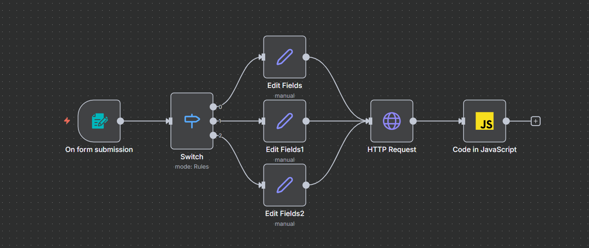

# 🌦️ City Weather Analyzer (n8n + JavaScript)

## 📋 Overview
This workflow is a backend logic demonstration built with **n8n**. It takes a user's city selection via a web form, fetches real-time meteorological data using a public API, and uses **Custom JavaScript** to calculate specific weather metrics (Daily Min/Max Temperatures).



## ⚡ Key Features
* **Form Handling:** Captures user input (City selection) via n8n Form Trigger.
* **Conditional Logic:** Routes the workflow based on the selected city (Tehran, Mashhad, Shiraz) to assign correct coordinates.
* **API Integration:** Connects to the **Open-Meteo API** to retrieve raw hourly weather data.
* **Data Processing (Code Node):** Uses **JavaScript** to algorithmically process the JSON response and extract the minimum and maximum temperatures for the day.

## 🛠️ Tech Stack
* **Workflow Engine:** n8n
* **Language:** JavaScript (ES6) for data transformation.
* **API:** Open-Meteo (REST API).

## ⚙️ How it Works
1.  **Trigger:** User selects a city from the dropdown form.
2.  **Switch & Set:** The workflow converts the city name into Latitude/Longitude coordinates.
3.  **HTTP Request:** Sends a request to the weather service.
4.  **Computation:** A JavaScript function loops through the hourly data arrays:
    ```javascript
    // Sample Logic used in the node
    for (const t of temps) {
      if (t < minTemp) minTemp = t;
      if (t > maxTemp) maxTemp = t;
    }
    ```
5.  **Output:** Returns a simplified JSON object with the exact Min/Max values and their timestamps.

## 🚀 How to Use
1.  Download `weather.json`.
2.  Import it into n8n.
3.  Execute the workflow.
4.  Use the "Test URL" provided by the Form Trigger node to submit a city.

---
*Developed by [mahdi felfeli]*
